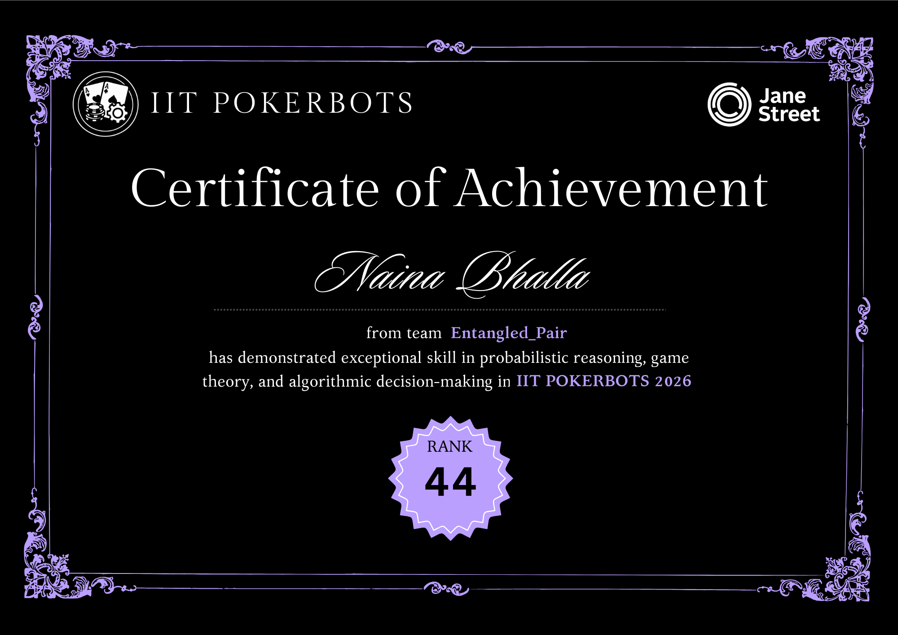

# IIT Pokerbots 2026 (Sponsored by Jane Street) - Rank 44 (India)

This repository contains the source code, game engine, and bot logic for our submission to the 2026 Pokerbots Competition. Our team **Entangled_Pair**, comprising of my teammate, [Aman Srivastava](https://github.com/Aman02032006) and I achieved a national rank of **44th across India**.

## Strategy & Implementation
Our bot's logic relies on robust statistical evaluation, opponent modeling, and dynamic time management to make mathematically sound decisions in real-time. To ensure optimal performance preflop, we bypassed heavy live calculations by pre-computing starting hand strengths using `MonteCarloEquityEstimation.py`. These millions of simulated runouts are embedded directly into the bot as a fast lookup dictionary, allowing instant and highly accurate preflop decisions.

A core component of our strategy is dynamic opponent profiling. The bot tracks key statistics like Voluntarily Put in Pot (VPIP) and aggression frequency to categorize the opponent into distinct archetypes (e.g., NIT, MANIAC, STATION). This high-level profiling is combined with a granular Bayesian range estimator. Starting with a realistic baseline range, the bot continuously updates the probability distribution of the opponent's hole cards based on their bet sizing, checks, and any cards revealed during the auction phase.

For postflop play, the bot calculates its win probability against this refined Bayesian range using live Monte Carlo simulations. To strictly adhere to the competition's 20-second time bank limit, the bot's engine dynamically throttles the number of simulation iterations based on the remaining clock. This synergistic approach ensures the bot aggressively exploits opponent tendencies while mathematically eliminating the risk of timeout penalties.

## Official Certificate

## Project Structure
* `bots/`: Contains all bot iterations, from baseline opponents (`explBot`, `calling_station_bot`) to our final competitive bot (`xbot2.py`).
* `engine/`: The core game engine and configuration files used to simulate matches.
* `utils/`: Strategic tools including our Monte Carlo equity estimator.
* `pkbot/`: Boilerplate code provided by the competition organizers.

## How to Run Locally
1. Clone the repository.
2. Install dependencies: `pip install -r requirements.txt`
3. Configure the match: Open `config.py` and specify the file paths for the bots you want to pit against each other.
4. Run a simulation: Execute `python engine.py` from your terminal. To run the match with compressed logs, use `python engine.py --small_log`.
